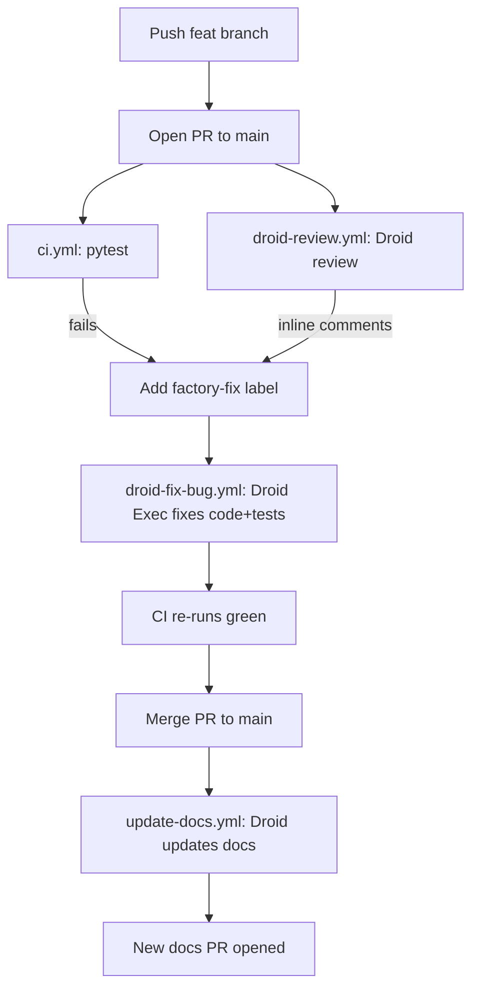

# Factory-Powered SRE Agent — CI/CD Remediation Demo

End-to-end demo of Factory acting as an autonomous engineering teammate inside the SDLC: CI catches a bug, Factory Droid reviews the PR, fixes the code on a label, and opens a follow-up documentation PR after merge.

Target runtime: 7-10 minutes.

## Demo thesis

> "Factory is not replacing GitHub, CI/CD, or human review. It operates inside those systems. The developer workflow stays familiar, but bug diagnosis, test repair, code review, and documentation updates become agent-assisted and partially autonomous."

## What gets shown

| Phase | Actor | Outcome |
|-------|-------|---------|
| 1. PR opened | Developer | Buggy `calculate_reserved_concurrency` lands on a feature branch |
| 2. CI fails | GitHub Actions | `pytest` shows the bug |
| 3. PR review | Factory Droid | Inline review comments on the diff |
| 4. Apply `factory-fix` label | Human | Authorises autonomous remediation |
| 5. Droid Exec fix | Factory Droid | Pushes a fix commit to the PR |
| 6. CI passes | GitHub Actions | Green build on the same PR |
| 7. Merge to main | Human | Standard merge |
| 8. Docs PR | Factory Droid | New docs PR opens automatically |

## Architecture



---

## One-time setup

Do these once per repo, before the first run.

### 1. Configure GitHub repo secrets

In the repo settings -> Secrets and variables -> Actions, add:

- `FACTORY_API_KEY` — your Factory API key. Used by all three Droid workflows.

`GITHUB_TOKEN` is provided automatically by GitHub Actions; nothing to add.

### 2. Create the `factory-fix` label

In the repo -> Issues -> Labels:

- Name: `factory-fix`
- Description: `Trigger Factory Droid to attempt an autonomous fix on this PR`
- Colour: any (suggest red/orange)

Also create the `documentation` and `automated` labels (used by the docs PR).

### 3. Verify workflows are present on `main`

```
.github/workflows/ci.yml
.github/workflows/droid-review.yml
.github/workflows/droid-fix-bug.yml
.github/workflows/update-docs.yml
```

### 4. (Optional) Local test run

```bash
pip install -r backend/requirements.txt
pip install -r requirements-dev.txt
pytest
```

Should report all `test_lambda_scaling.py` tests passing.

---

## Pre-demo: stage the bug branch

The buggy branch is created locally during initial setup. To get it onto GitHub before the demo:

```bash
git checkout feat/lambda-scaling-recommendation
git push -u origin feat/lambda-scaling-recommendation
git checkout main
```

Do **not** open the PR yet — that's step 2 of the live demo.

---

## Live demo script (7-10 minutes)

### Step 0 — Architecture diagram (~45s)

Show the diagram in this file. State the thesis. Emphasise that the workflows are the demo, not the SRE app.

### Step 1 — Show the bug (~1m)

Open `backend/remediation/lambda_scaling.py` on the `feat/lambda-scaling-recommendation` branch:

```python
def calculate_reserved_concurrency(current_throttles, avg_rps):
    return avg_rps * 0.5
```

Call out the issues:
- Returns a `float`; AWS API rejects floats.
- Underestimates by 50% — guarantees continued throttling.
- No minimum safety floor.
- Will recommend below current production load.

### Step 2 — Open PR (~30s)

On GitHub, open a PR from `feat/lambda-scaling-recommendation` -> `main` titled:

> `feat: add reserved concurrency recommendation`

Mention this looks like a normal developer PR — no Factory-specific custom UI.

### Step 3 — Watch CI fail (~1m)

The `CI` workflow runs `pytest`. Tests in `tests/test_lambda_scaling.py` fail:

- `test_returns_integer` — float vs int.
- `test_enforces_minimum_floor_for_low_traffic` — returns < 10.
- `test_does_not_recommend_below_observed_load` — returns 0.5 * avg_rps.

Sound bite: *"CI is the first line of defence. It caught the bug before merge."*

### Step 4 — Watch Factory Droid review (~1m)

The `Factory Droid Code Review` workflow runs in parallel. Show the inline comments Droid leaves on the PR diff: float return type, missing safety buffer, etc.

Sound bite: *"Factory does not just wait for a human reviewer. It reviews the PR as part of the normal GitHub workflow and leaves targeted feedback."*

### Step 5 — Add the `factory-fix` label (~30s)

On the PR, click Labels -> `factory-fix`.

Sound bite: *"I am using a label as the human control point. The agent does not mutate code unless the team asks it to."*

### Step 6 — Watch Factory fix the code (~1m 30s)

The `Factory Fix Bug` workflow:

1. Checks out the PR branch.
2. Runs `pytest` to capture the failure output.
3. Runs `droid exec --auto low` with the fix prompt.
4. Commits as `factory-droid[bot]` and pushes back to the PR head branch.

Refresh the PR — a new commit appears, CI re-runs, all tests pass.

Sound bite: *"Factory inspects the failure, modifies the code, updates tests, and pushes the fix back to the same PR. CI is now green."*

### Step 7 — Merge the PR (~30s)

Click `Merge pull request`. Standard squash or merge — your choice.

### Step 8 — Watch the documentation PR open (~1m)

The `Auto-Update Documentation` workflow triggers on `push` to `main` for `backend/**/*.py`:

1. Diffs the merge commit.
2. Asks Droid to update `README.md` and `docs/` to reflect the new remediation logic.
3. Creates a new branch `docs/factory-update-<timestamp>`, commits, pushes, and opens a PR with the `documentation` and `automated` labels.

Open the new docs PR. Show that examples and operational guidance now match the merged code.

Sound bite: *"After merge, Factory detects that production behaviour changed and opens a documentation PR for human review. Documentation never goes stale."*

### Step 9 — Closing (~1m)

Restate the thesis. Highlight the four moments of Factory autonomy:

1. Automated review (`droid-review.yml`).
2. Label-triggered remediation (`droid-fix-bug.yml`).
3. Real fix + test update + push.
4. Post-merge documentation PR (`update-docs.yml`).

Sound bite: *"This is why Factory is more than a coding assistant. It is participating across the engineering lifecycle: review, remediation, testing, documentation, and PR workflow."*

---

## Resetting between runs

The repo has two annotated tags pointing at the pristine baselines:

- `demo-baseline-main` — the fixed-code state of `main`
- `demo-baseline-buggy` — the buggy commit on top of that baseline

Use the reset script (PowerShell) from the repo root:

```powershell
.\scripts\reset-demo.ps1
```

What it does:

1. Closes any open demo PRs (requires `gh`; warns if missing).
2. Deletes the remote `feat/lambda-scaling-recommendation` branch and any leftover `docs/factory-update-*` branches.
3. Hard-resets local `main` to `demo-baseline-main` and force-pushes (`--force-with-lease`).
4. Recreates the local `feat/lambda-scaling-recommendation` branch from `demo-baseline-buggy`.
5. Leaves the buggy branch unpushed so you can push it live during the next demo.

Then for the next run:

```powershell
git push -u origin feat/lambda-scaling-recommendation
# open the PR on GitHub
```

The script refuses to run with uncommitted changes. If you ever need to recreate the tags from scratch, point them at the relevant commits and `git push origin demo-baseline-main demo-baseline-buggy`.

---

## Troubleshooting

| Symptom | Likely cause | Fix |
|---------|--------------|-----|
| CI never starts | Workflow files not on default branch | Merge `.github/workflows/**` to `main` |
| Droid workflows skip with "secret missing" | `FACTORY_API_KEY` not set | Add it under repo Secrets |
| `factory-fix` does nothing | Label name typo, or workflow file not on `main` | Recreate the label exactly as `factory-fix` |
| Docs PR never opens | No diff in `backend/**/*.py` on the merge | Confirm the merge actually touched a `.py` under `backend/` |
| Droid CLI install fails on Actions | Network egress blocked | Use a self-hosted runner or pin the CLI version |

---

## File map

| File | Purpose |
|------|---------|
| `backend/remediation/lambda_scaling.py` | The function under demo (fixed on `main`) |
| `tests/test_lambda_scaling.py` | Pytest assertions that fail against the buggy branch |
| `.github/workflows/ci.yml` | Runs pytest on every PR |
| `.github/workflows/droid-review.yml` | Factory automated PR review (deep mode + auto-approve) |
| `.github/workflows/droid-fix-bug.yml` | Label-triggered Droid Exec fix |
| `.github/workflows/update-docs.yml` | Post-merge Droid docs PR |
| `docs/remediation-playbooks.md` | SRE runbook referenced by docs auto-update |
| `docs/lambda-throttling.md` | Throttling reference referenced by docs auto-update |
