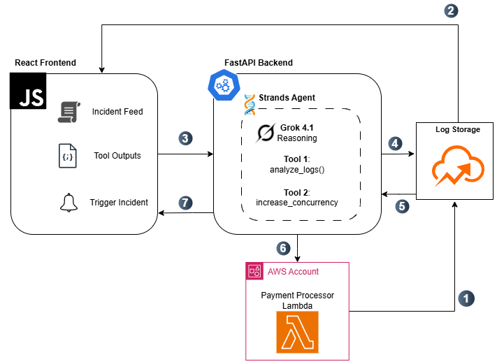

# SRE Agent Demo — Powered by Grok & Strands Agents

An AI-driven Site Reliability Engineering (SRE) agent that autonomously investigates and remediates a throttled AWS Lambda payment processing function. This demo showcases **Grok's reasoning capabilities**, **automatic prompt caching**, **Structured Outputs** and **real tool execution** via the [Strands Agents](https://strandsagents.com) framework.

## Business Impact

In traditional environments, diagnosing and remediating Lambda throttling incidents can take 35–45 minutes, requiring log inspection, metric analysis, and manual scaling adjustments. This autonomous SRE agent reduces remediation time to 2–3 minutes, representing:

- ~90–95% reduction in Mean Time To Resolution (MTTR)
- 20–40% reduction in incident response costs
- Reduced on-call engineering load
- Fewer customer-facing transaction failures (Improving uptime and customer trust)
- Reallocation of SRE time toward proactive reliability improvements instead of reactive firefighting

---

## What This Demo Showcases

| Capability | How It's Demonstrated |
|---|---|
| **Grok Reasoning** | The agent reads raw CloudWatch-style logs and generates 2–3 structured hypotheses for the root cause of Lambda throttling |
| **Automatic Prompt Caching** | The system prompt (SRE persona, runbooks, tool descriptions) is cached by xAI automatically — subsequent agent calls are faster and cheaper |
| **Structured Output** | The agent leverages Grok's Structured Output capabilities for standardized UI display & storage  |
| **Agentic Workflow** | Each investigation step is a discrete Strands Agent tool call, making the chain transparent and observable |

---

## Incident Scenario

> **Payment processing Lambda function `payments-processor-prod` is experiencing AWS throttling.**
> Error rate has spiked to 45%. On-call engineer receives a PagerDuty alert and opens the SRE Agent dashboard.
> The agent takes it from there.

---

## Architecture Overview



---

## Project Structure

```
sre-agent-demo/
├── README.md
├── .env                          # API keys and AWS credentials (never commit this)
├── .env.example                  # Template with required variable names
├── .gitignore
│
├── images/
│   └── sre-flow.png              # Architecture diagram
│
├── scripts/
│   ├── create_lambda.py          # Creates the payments-processor-prod Lambda on AWS
│   └── generate_logs.py          # Generates emulated CloudWatch throttling logs as JSON
│
├── logs/
│   ├── .gitkeep                  # Keeps folder in git without committing generated logs
│   └── cloudwatch_logs.json      # Generated log events (created by generate_logs.py, gitignored)
│
├── backend/
│   ├── main.py                   # FastAPI app — SSE streaming endpoints for agent workflow
│   ├── agent.py                  # Strands Agent definition with xAIModel
│   ├── tools.py                  # Tool implementations: analyze_logs, increase_lambda_concurrency
│   └── requirements.txt
│
└── frontend/
    ├── index.html                # Vite HTML entry point
    ├── package.json
    ├── vite.config.js
    ├── tailwind.config.js
    ├── postcss.config.js
    └── src/
        ├── App.jsx               # Root component — manages phase lifecycle & state
        ├── main.jsx              # React entry point
        ├── index.css
        ├── components/
        │   ├── IncidentDashboard.jsx   # Main dashboard layout and status display
        │   ├── AgentStep.jsx           # Step card: tool events and Grok's hypotheses
        │   ├── ApprovalGate.jsx        # Human approval gate between analysis and remediation
        │   └── StreamingText.jsx       # Streaming text renderer with markdown support
        └── lib/
            └── streamFetch.js          # SSE parsing utility for POST requests
```

---

## Agent Workflow (Step by Step)

### Step 1 — `analyze_logs` Tool

The agent is given a system prompt establishing its SRE persona and access to tools. It is instructed to first call `analyze_logs`.

**What the tool does:**
- Reads `logs/cloudwatch_logs.json`
- Passes the raw log events to the model context

**What Grok does:**
- Analyzes throttling errors, timestamps, concurrency metrics, and error patterns
- Generates 2–3 prioritized hypotheses, for example:
  1. Reserved concurrency limit (10) is too low for peak traffic: function is being throttled at the account level
  2. Downstream dependency (payment gateway) is slow, causing Lambda invocations to pile up and exhaust concurrency
  3. Cold start cascade: insufficient provisioned concurrency causing latency spikes that compound throttling

> **This step demonstrates Grok's reasoning**: the model traces through log patterns to produce structured, prioritized hypotheses with evidence citations from the logs.

---

### Step 1.5 — Human Approval Gate

Before any remediation is executed, the UI presents an `ApprovalGate` — a confirmation step requiring explicit human sign-off.

**What it shows:**
- The proposed AWS action (function name, concurrency change)
- Grok's rationale for choosing this remediation
- **Approve** and **Reject** buttons

The agent is paused until the engineer confirms. Only on approval does the remediation step begin. This enforces the principle that AI agents should act *with* humans, not *instead of* them, especially for production infrastructure changes.

---

### Step 2 — `increase_lambda_concurrency` Tool

Based on Hypothesis #1 (most likely), the agent proposes and then executes a remediation.

**What the tool does:**
- Calls `boto3` → `lambda.put_function_concurrency()`
- Updates `payments-processor-prod` reserved concurrency from `10` to `20`
- Returns the AWS API response confirming the new configuration

**What Grok does:**
- Explains why increasing concurrency addresses the identified hypothesis
- Summarises the remediation action taken
- Notes what to monitor to confirm the incident is resolved

> **This step demonstrates real tool execution**: the agent doesn't just recommenda fix, it acts on behalf of the user.

---

## Prompt Caching

The SRE agent system prompt includes:
- Role definition and SRE runbooks
- Tool schemas and usage guidelines
- AWS environment context

xAI's API automatically caches this system prompt across requests within a session. This means:
- **First call**: full system prompt tokens are processed
- **Subsequent calls**: cached prefix is reused — lower latency, lower cost

No code changes are needed to enable this, it is automatic feature for the `grok-4-1-fast-reasoning` model.

---

## Prerequisites

- Python 3.11+
- Node.js 18+
- AWS account with permissions to:
  - Create Lambda functions (`lambda:CreateFunction`)
  - Update Lambda concurrency (`lambda:PutFunctionConcurrency`)
- AWS credentials configured (`~/.aws/credentials` or environment variables)
- xAI API key ([get one at console.x.ai](https://console.x.ai))

---

## Setup

### 1. Clone and install backend dependencies

```bash
cd backend
pip install -r requirements.txt
```

`requirements.txt` includes:
```
strands-agents
strands-xai
fastapi
uvicorn[standard]
boto3
python-dotenv
```

### 2. Configure environment variables

Copy the example env file and fill in your values:

```bash
cp .env.example .env
```

`.env` (never commit this file):
```
# xAI
XAI_API_KEY=xai-your-key-here

# AWS
AWS_ACCESS_KEY_ID=your-access-key-id
AWS_SECRET_ACCESS_KEY=your-secret-access-key
AWS_REGION=us-east-1
```

`.env.example` is committed to the repo with empty values as a reference template. The backend loads these automatically via `python-dotenv`. Add `.env` to your `.gitignore`.

### 3. Create the Lambda function on AWS

```bash
python scripts/create_lambda.py
```

This creates `payments-processor-prod` with reserved concurrency set to `10` to simulate the throttling condition.

### 4. Generate emulated CloudWatch logs

```bash
python scripts/generate_logs.py
```

This writes `logs/cloudwatch_logs.json` containing ~200 log events spanning a 30-minute window, including:
- Successful payment processing events
- `Rate exceeded` throttling errors
- High-latency invocation warnings
- Error rate metrics

### 5. Start the backend

```bash
cd backend
uvicorn main:app --reload --port 8000
```

### 6. Start the frontend

```bash
cd frontend
npm install
npm run dev
```

Open [http://localhost:5173](http://localhost:5173)

---

## Running the Demo

1. Open the React dashboard in your browser
2. Click **Start Incident**
3. Watch the agent work in real time:
   - **Step cards** stream each tool invocation — showing the tool call, its output, and Grok's structured hypotheses as they are generated
   - An **Approval Gate** appears once analysis is complete, displaying the proposed remediation and asking you to confirm
4. Click **Approve** to execute the remediation, or **Reject** to abort
5. Observe the Lambda function's reserved concurrency update in the AWS console (or via `aws lambda get-function-concurrency --function-name payments-processor-prod`)

---

## Key Files Reference

| File | Purpose |
|---|---|
| [scripts/create_lambda.py](scripts/create_lambda.py) | Provisions the throttled Lambda on AWS |
| [scripts/generate_logs.py](scripts/generate_logs.py) | Generates realistic CloudWatch-style throttling logs |
| [backend/agent.py](backend/agent.py) | Strands Agent with `xAIModel(grok-4-1-fast-reasoning)` |
| [backend/tools.py](backend/tools.py) | `analyze_logs` and `increase_lambda_concurrency` tool implementations |
| [backend/main.py](backend/main.py) | FastAPI endpoint that triggers the agent |
| [frontend/src/components/IncidentDashboard.jsx](frontend/src/components/IncidentDashboard.jsx) | Main UI layout |

---

## Tech Stack

| Layer | Technology |
|---|---|
| LLM | [Grok `grok-4-1-fast-reasoning`](https://docs.x.ai/overview) via xAI API |
| Agent Framework | [Strands Agents](https://strandsagents.com) + `strands-xai` |
| Backend | Python / FastAPI |
| AWS SDK | `boto3` |
| Frontend | React (Vite) |
| Log Storage | Local JSON (`logs/cloudwatch_logs.json`) |

---

## Why Grok for SRE?

- **Long context (2M tokens)**: can ingest entire log files, runbooks, and historical incident data in a single call
- **Reasoning mode**: produces transparent, step-by-step analysis rather than a black-box answer, ideal for root cause investigation
- **Function calling**: natively supports tool use, enabling agents to execute real remediations
- **Speed**: `grok-4-1-fast-reasoning` is optimised for low-latency agentic loops

---

## License

MIT
